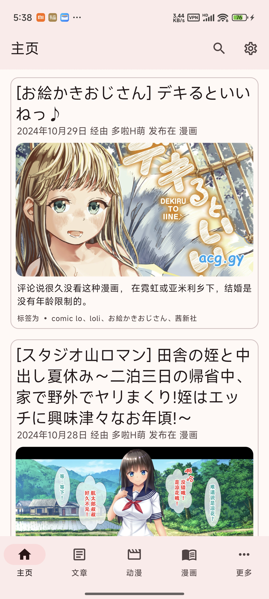
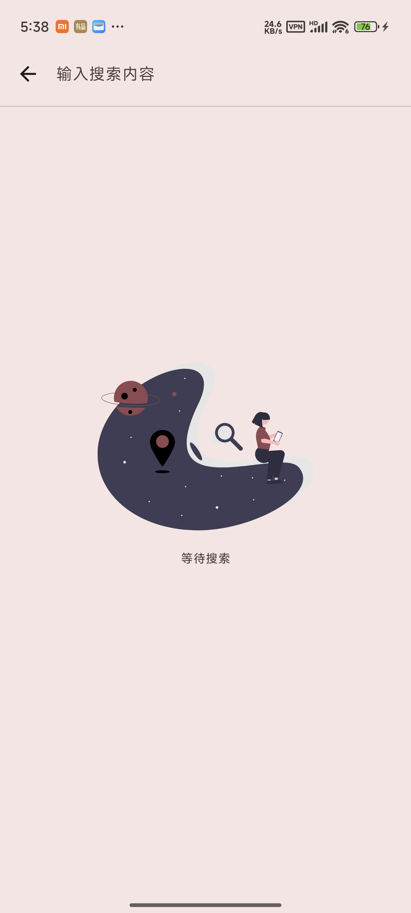
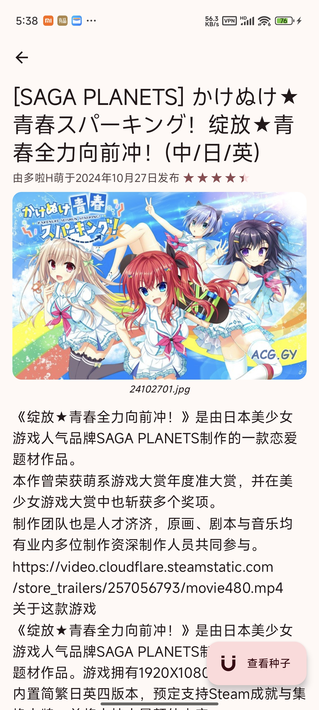
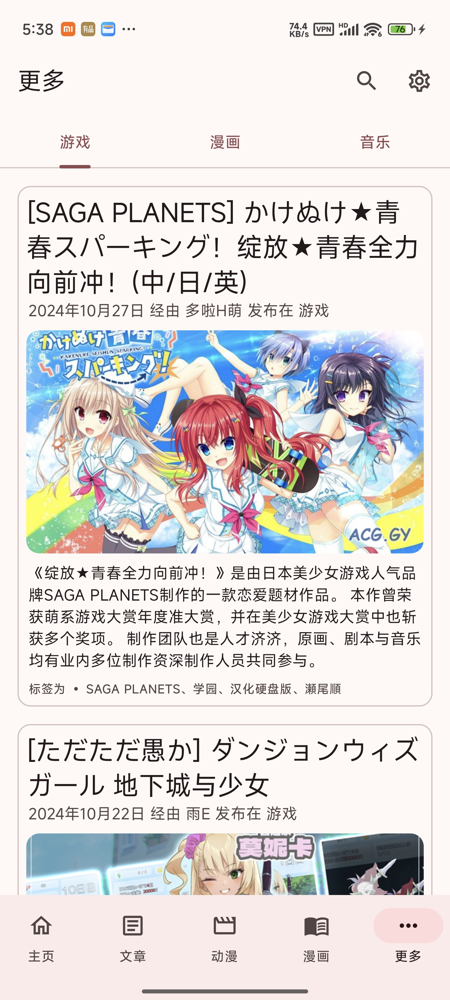
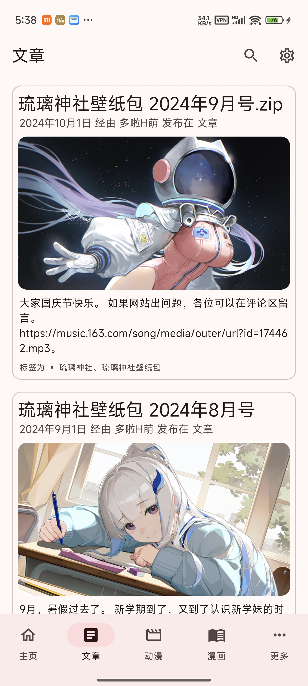

# Hacg Compose
一个第三方的HACG应用，由Compose强力驱动。上次开源的版本我看还是有几个人在用，我就再写一个。

反正原来的源代码也丢失了，索性重构一下。

**本代码仅供参考、交流、学习。请勿在公共领域传播，** 你也不想我开发个小应用直接变成牢字辈的吧。

## 等待完成
- 音乐播放：现在播放器就是一个摆设。

## 注意
本应用不用任何形式的下载。如果您在找一款可以下载软件，那么您来错地方了。

**未成年人请勿下载，下载本应用请确保您大于18岁。**

_而且，我根本就不会Native开发。_

## 截屏

## 开源协议
MIT。
### 被许可人权利
特此授予任何人免费获得本软件和相关文档文件（“软件”）副本的许可，不受限制地处理本软件，包括但不限于使用、复制、修改、合并 、发布、分发、再许可的权利， 被许可人有权利使用、复制、修改、合并、出版发行、散布、再许可和/或贩售软件及软件的副本，及授予被供应人同等权利，惟服从以下义务。

### 被许可人义务
在软件和软件的所有副本中都必须包含以上著作权声明和本许可声明。

### 其他重要特性
此许可证并非属copyleft的自由软件许可协议条款，允许在自由及开放源代码软件或非自由软件（proprietary software）所使用。

MIT的内容可依照程序著作权者的需求更改内容。此亦为MIT与BSD（The BSD license, 3-clause BSD license）本质上不同处。

MIT许可证可与其他许可证并存。另外，MIT条款也是自由软件基金会（FSF）所认可的自由软件许可协议条款，与GPL兼容。